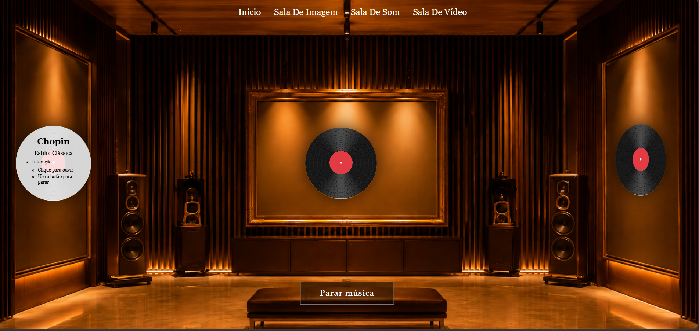
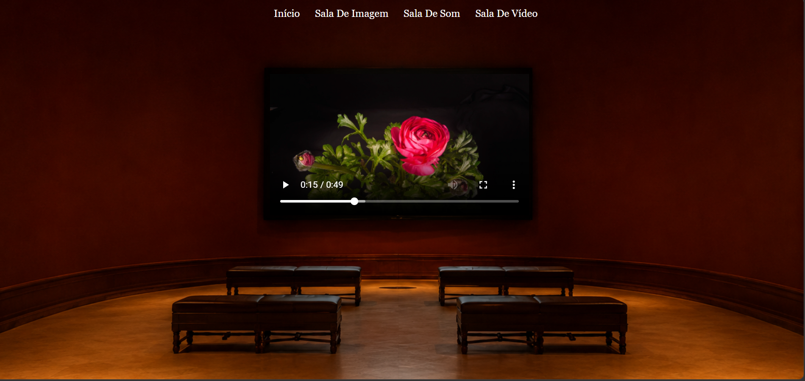
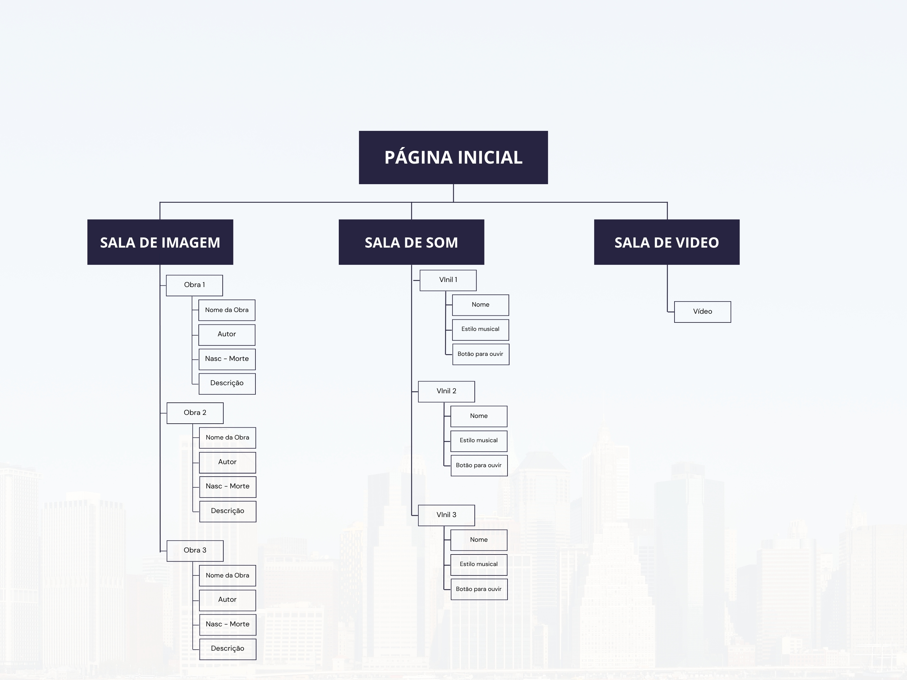

# Capítulo 2: Interface do utilizador

A informação do website foi organizada de forma simples e dividida por áreas temáticas. O projeto é composto por uma página inicial e três salas principais, cada uma dedicada a um tipo de conteúdo multimédia.

A página inicial funciona como entrada do museu digital. Nesta página, o utilizador acompanha uma sequência visual (com o movimento de scroll do rato), finalizando em três portas e um livro para marcar a presença no museu. 

As restantes páginas estão organizadas de acordo com o tipo de conteúdo apresentado:

- [`sala-imagem.html`](sala-imagem.html) apresenta a sala dedicada às obras visuais;
- [`sala-som.html`](sala-som.html) apresenta a sala dedicada aos conteúdos sonoros;
- [`sala-video.html`](sala-video.html) apresenta a sala dedicada ao conteúdo audiovisual.

A organização do site permite que o utilizador compreenda facilmente a estrutura, pois cada página tem uma função específica dentro da experiência do museu.

O website também foi pensado para ser responsivo. A versão desktop foi usada como base principal do projeto, permitindo uma apresentação mais ampla dos ambientes e dos elementos visuais. Para tablet, foram feitos ajustes no CSS através de media queries, funções no javascript para o toque do ecrã, adaptando tamanhos, posições e espaçamentos para garantir que a navegação continuasse funcional em ecrãs menores.

---

## Interface and Common Features

A interface do website segue um conjunto de elementos comuns que garantem consistência visual e facilidade de navegação:

- Barra de navegação presente em todas as páginas  
- Layout centrado e organizado por áreas temáticas  
- Elementos interativos (hover, clique, animações)  
- Paleta de cores e tipografia coerentes  
- Estrutura responsiva adaptada a diferentes dispositivos  

---

## Wireframes

---
### **Sala Principal**
  
Descrição: Sala principal, final do movimento do scroll, onde temos 3 portas e um livro de presença fechado.

  
Descrição: Livro aberto, onde mostra um formulário para registrar presença.

---

### **Sala de Imagem**
  
Descrição: Estrutura com três quadros principais, cada um com área de informação associada.

---

### **Sala de Som**
  
Descrição: Três discos de vinil interativos e botão central para parar a música.

---

### **Sala de Vídeo**
  
Descrição: Ecrã central de vídeo, colunas laterais e área de assentos simulando uma sala de cinema.

---

## Sitemap

  

---

## Responsividade

O website foi desenvolvido com foco na responsividade:

- A versão desktop foi usada como base principal  
- Para tablet, foram aplicadas *media queries* no CSS  
- Ajustes incluíram:  
  - Redução de tamanhos  
  - Reposicionamento de elementos  
  - Ajustes de espaçamento  
  - Funções JavaScript adaptadas ao toque  

---

[< Previous](c1.md) | [^ Main](../../../) | [Next >](c3.md)
