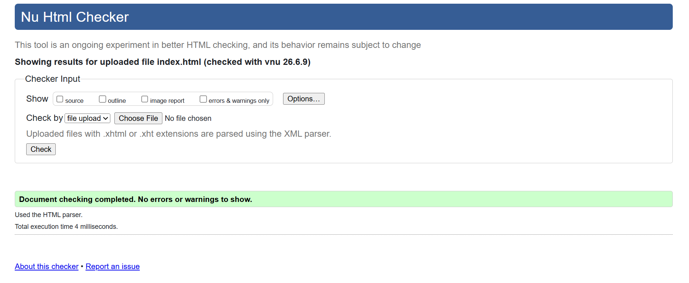
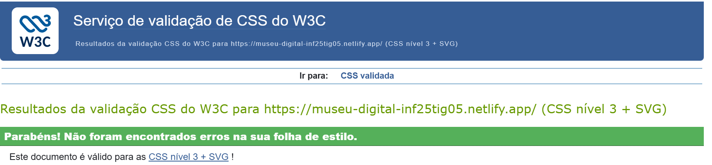

# Capítulo 3: Produto

O produto final é um website multimédia chamado **Museu Digital Multimédia**.

O website simula a experiência de visita a um museu digital. A navegação começa numa página inicial com uma sequência visual de entrada e, depois disso, o utilizador pode aceder a três salas principais: sala de imagem, sala de som e sala de vídeo.

Cada sala foi criada para apresentar um tipo diferente de conteúdo multimédia, mantendo a ideia de circulação por espaços dentro de um museu.

## 3.1 Instalação

O projeto foi organizado numa organização do GitHub chamada `inf25tig05`. Com o link [https://github.com/inf25tig05/museu-digital-multimedia](https://github.com/inf25tig05/museu-digital-multimedia)

Depois da organização do projeto no GitHub, o website foi publicado através do Netlify. Para isso, o repositório foi ligado ao Netlify, permitindo que o site fosse disponibilizado online a partir dos ficheiros presentes no GitHub.

Link do Netfly: [https://museu-digital-inf25tig05.netlify.app/](https://museu-digital-inf25tig05.netlify.app/)

## 3.2 Utilização

O website não necessita de autenticação.

O utilizador inicia a experiência na página inicial, onde acompanha a entrada visual do museu. Na versão desktop, a progressão da entrada é feita através do scroll do mouse. Na versão tablet, a interação foi adaptada para funcionar através do gesto de deslizar no ecrã.

Depois da entrada, o utilizador pode aceder às três salas principais:

- sala de imagem;
- sala de som;
- sala de vídeo.

Na sala de imagem, o utilizador pode visualizar obras e consultar informações associadas a cada uma delas.
Na sala de som, o utilizador pode interagir com os discos de vinil e ouvir os ficheiros de áudio disponíveis.
Na sala de vídeo, o utilizador pode assistir ao conteúdo audiovisual integrado no website.

## 3.3 Ajuda da aplicação/produto


Na página inicial, as portas funcionan como ponto principal de navegação, o livro interativo funciona como um formulário para registrar os visitantes do museu. 

As páginas internas possuem um menu superior com ligações para:

- início;
- sala de imagem;
- sala de som;
- sala de vídeo.

Na sala de imagem, as informações das obras aparecem quando o utilizador interage com os quadros. Desta forma, a página mantém o aspeto visual do museu e mostra as informações apenas quando necessário.

Na sala de som, os discos funcionam como elementos interativos. Ao clicar num disco, o áudio correspondente é reproduzido. Também existe um botão para parar a música.

A interface foi pensada para que o utilizador consiga navegar pelo projeto sem precisar de instruções complexas.

## 3.4 Formulário

O projeto possui um formulário na página inicial, integrado no livro interativo.

O formulário permite ao utilizador marcar presença, preenchendo os seguintes campos:

- nome;
- email;
- telefone.

A validação dos dados é feita com atributos do próprio HTML.

O atributo `required` obriga o utilizador a preencher os campos antes de submeter o formulário. O campo de email utiliza `type="email"`, o que ajuda a verificar se o valor introduzido tem formato de email.

Exemplo de validação no formulário:

```html
<input type="text" name="nome" required>
<input type="email" name="email" required>
<input type="tel" name="telefone" required>
```

Além disso, o JavaScript impede o envio normal do formulário e apresenta uma mensagem de confirmação ao utilizador:

```js
formPresenca.addEventListener("submit", function(event) {
  event.preventDefault();
  mensagemPresenca.innerText = "Presença marcada com sucesso!";
});
```

## 3.5 Validação do HTML5 e do CSS3

A validação do HTML e do CSS deve ser feita através dos validadores oficiais da W3C.

Foram utilizados os seguintes validadores:

- [HTML Validator](https://validator.w3.org/nu/)

  

- [CSS Validator](https://jigsaw.w3.org/css-validator/)

  

O processo de validação consiste em inserir o link da página publicada ou enviar diretamente os ficheiros HTML e CSS para os validadores.

Foram validadas as principais páginas do projeto:

- `index.html`;
- `sala-imagem.html`;
- `sala-som.html`;
- `sala-video.html`.

Também foram verificados os ficheiros CSS utilizados no website.

As capturas dos resultados da validação devem ser colocadas na pasta `doc/images`.

Exemplo de inserção das imagens no relatório:

```md


```

## 3.6 Detalhes de implementação

Esta secção apresenta os principais requisitos mínimos do projeto e exemplos da sua utilização.

### Requisitos das páginas

| Requirement | Usage Example |
| :---: | :--- |
| At least 4 pages | [`index.html`](../index.html), [`sala-imagem.html`](../sala-imagem.html), [`sala-som.html`](../sala-som.html) e [`sala-video.html`](../sala-video.html). |
| 1 XML document | [`sala-imagem.xml`](../xml/sala-imagem.xml). |
| 1 XSD document | [`sala-imagem.xsd`](../xml/sala-imagem.xsd). |
| CSS file | [`style.css`](../css/style.css), [`sala-imagem.css`](../css/sala-imagem.css), [`sala-som.css`](../css/sala-som.css) e [`sala-video.css`](../css/sala-video.css). |

### Validação do XML

O XML foi utilizado para organizar as informações das obras apresentadas na sala de imagem.

O ficheiro `sala-imagem.xml` guarda dados como título, autor, datas do autor, imagem e descrição. O ficheiro `sala-imagem.xsd` define a estrutura esperada para esses dados.

A validação foi feita comparando o XML com o XSD, verificando se os elementos estavam organizados corretamente e se os dados seguiam a estrutura definida.

### Requisitos mínimos de HTML

| Requirement | Usage Example |
| :---: | :--- |
| XML file download | O XML é carregado através de JavaScript com `fetch("./xml/sala-imagem.xml")`, no ficheiro [`sala-imagem.js`](../js/sala-imagem.js). |
| Table | Foi utilizada na informação das obras, na sala de imagem. |
| List | Foram utilizadas listas no menu de navegação. |
| Nested List | Foi utilizada na informação dos vinis, na sala de som. |
| Highlight | Foi utilizado para destacar o título das obras na sala de imagem. |
| Image | Foram utilizadas imagens na página inicial e nas salas. |
| Figure | Cada obra da sala de imagem foi organizada com figure. |
| Figure Caption | As informações das obras foram colocadas dentro de um figcaption. |
| Internal Link | O menu possui links internos. |
| Form | O formulário de presença está presente no index com  os campos de nome, email e telefone. |

### Requisitos mínimos de CSS

| Requirement | Usage Example |
| :---: | :--- |
| Type selector | `body { background-color: black; }`|
| Id selector |  `#sala-imagem { ... }` |
| Class Selector | `.quadro-sala { ... }` |
| Pseudo-class Selector | `#cabecalho-sala a:hover { color: #d8b56d; }` |
| Attribute Selector |  `.quadro-sala[data-id="quadro-centro"]` |
| Pseudo-element Selector | `.info-obra h2::before` |
| Combinator Selector | `.quadro-sala:hover .info-obra` |
| Change Highlight style | `.info-obra mark`. |
| Image insertion | `background-image` |
| Hide an element |  `display: none` e `opacity: 0` |
| Text style |  `font-size` |
| Font style |  `Georgia, "Times New Roman", serif`. |
| Background style | `background-size: cover`, `background-position: center` e `background-repeat: no-repeat`. |
| float/position style | `position: absolute` |
| List style | `.info-disco ul` |
| Box element style | `padding`, `border-radius` |
| table style |  `.tabela-obra`, `.tabela-obra th` e `.tabela-obra td`. |
| Responsibility style 2 screen sizes | O website foi adaptado para desktop/notebook e tablet através de media querie |

## 3.7 Outros detalhes relevantes de implementação

Nesta secção são apresentados alguns elementos de valorização utilizados no projeto.

| Element | Usage Example |
| :---: | :--- |
| With JS, alter element content | `mensagemPresenca.innerText = "Presença marcada com sucesso!"` |
| With JS, alter element style |`fotos[i].style.opacity` |
| With JS, load XML and change element contents | O ficheiro [`sala-imagem.js`](../js/sala-imagem.js) carrega o XML e insere os dados das obras na página. |
| `<video>` element | A sala de vídeo utiliza a tag `<video>` para apresentar o ficheiro `video.mp4`. |
| `<audio>` element | A sala de som reproduz ficheiros de áudio através de JavaScript, utilizando os ficheiros da pasta `audio`. |
| With CSS, Flexbox |no cabeçalho `display: flex` para organizar os elementos de navegação. |
| With CSS, transition | Foram utilizadas transições no livro, nas informações das obras e nos elementos interativos. |
| With CSS, transform | Foram utilizados `transform`, `rotate`, `scale` e `perspective` para ajustar a posição e o efeito visual de elementos nas salas. |
| With CSS, animation | A animação principal da página inicial é controlada com JavaScript. |
| Responsividade com CSS | Foram utilizadas media queries para adaptar o site ao ecrã de tablet. |
| Eventos de toque em JavaScript | Na adaptação para tablet, foram adicionados eventos como `touchstart`, `touchmove` e `touchend` para permitir a interação por toque. |


---

[< Previous](c2.md) | [^ Main](../README.md) | [Next >](c4.md)
